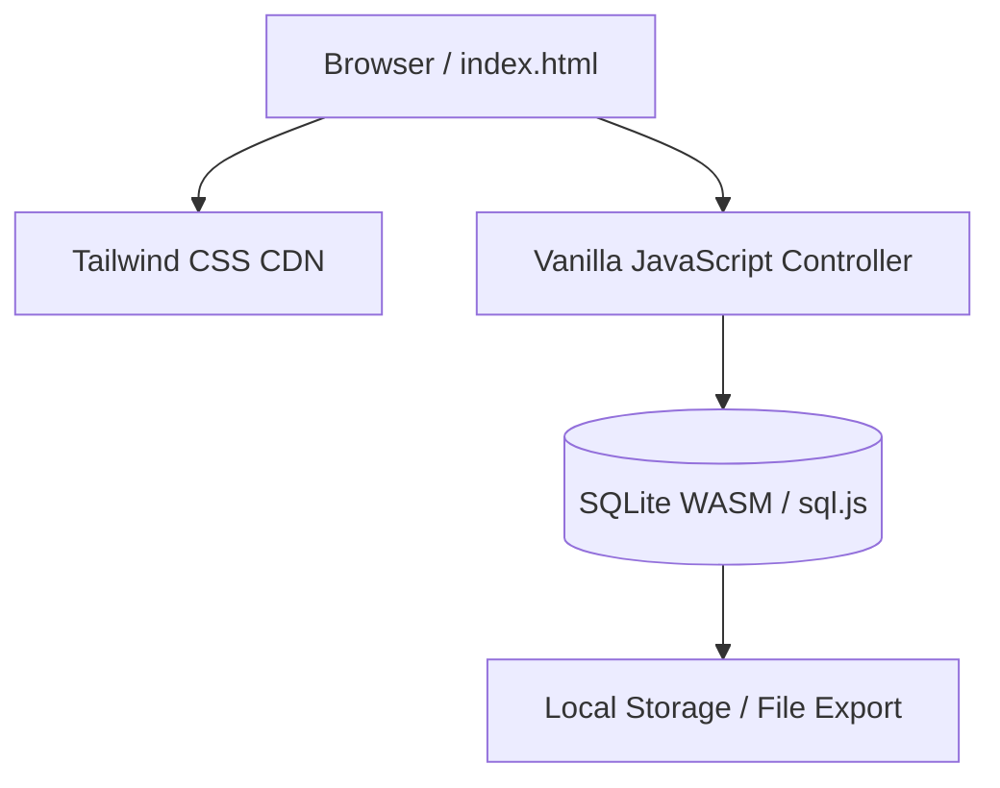

# VibeInventory: Technical Specification & BDD Scenarios

This document specifies the requirements, technical architecture, and functional behavior for **VibeInventory**, a minimal, local, single-user e-commerce inventory management system.

---

## 1. System Overview

**VibeInventory** is designed as a lightweight, zero-installation local web application. It enables store managers to:
1. **View inventory levels** with visual cues for low or out-of-stock items.
2. **Record inbound stock** (both adding to existing items and registering new products).
3. **Record outbound stock** (representing sales), which automatically decrements inventory levels, prevents sales exceeding stock, and calculates revenue.

---

## 2. System Architecture

To keep the system strictly minimal and local, it uses a **Single Page Application (SPA)** architecture running entirely in the user's browser with no server-side backend required.



### Technology Stack
*   **Structure:** Semantic HTML5.
*   **Styling:** Tailwind CSS (via CDN) for modern, responsive layout.
*   **Logic:** Vanilla JavaScript (`ES6+`) structured using standard modular patterns.
*   **Database:** SQLite in-browser via [sql.js](https://github.com/sql-js/sql.js/) (WebAssembly compilation of SQLite). 
*   **State Persistence:** 
    *   The SQLite database state is initialized in memory.
    *   To prevent loss of data on refresh, the database binary state is serialized to a base64 string and persisted to browser `localStorage` (or IndexedDB).
    *   An **Export DB** button allows downloading the raw `.sqlite` file.
    *   An **Import DB** button allows uploading a previously saved `.sqlite` file.

---

## 3. Database Schema

The local SQLite database contains two main tables: `products` and `transactions`.

```sql
-- Table containing the current state of products
CREATE TABLE IF NOT EXISTS products (
    id INTEGER PRIMARY KEY AUTOINCREMENT,
    sku TEXT UNIQUE NOT NULL,
    name TEXT NOT NULL,
    price REAL NOT NULL CHECK(price >= 0),
    quantity INTEGER NOT NULL DEFAULT 0 CHECK(quantity >= 0),
    low_stock_threshold INTEGER NOT NULL DEFAULT 5 CHECK(low_stock_threshold >= 0),
    created_at DATETIME DEFAULT CURRENT_TIMESTAMP
);

-- Table documenting all stock changes (inbound and outbound)
CREATE TABLE IF NOT EXISTS transactions (
    id INTEGER PRIMARY KEY AUTOINCREMENT,
    sku TEXT NOT NULL,
    type TEXT CHECK(type IN ('INBOUND', 'OUTBOUND')) NOT NULL,
    quantity INTEGER NOT NULL CHECK(quantity > 0),
    price REAL NOT NULL CHECK(price >= 0), -- Price at which the transaction occurred
    revenue REAL NOT NULL DEFAULT 0.0,      -- Calculated as quantity * price for OUTBOUND, 0.0 for INBOUND
    transaction_date DATETIME DEFAULT CURRENT_TIMESTAMP,
    FOREIGN KEY(sku) REFERENCES products(sku)
);
```

---

## 4. Behavior-Driven Development (BDD) Scenarios

The following features describe the functional behavior of VibeInventory using the Gherkin format (`Given-When-Then`).

### Feature 1: View Inventory Levels

**User Story:**
> **As a** Store Manager  
> **I want to** view a clear dashboard of all products, their quantities, and stock statuses  
> **So that** I can identify low stock and out-of-stock items immediately and avoid losing sales.

#### Scenario 1: Displaying current inventory levels with status badges
*   **Given** the database contains the following products:
    | name        | sku       | quantity | price  | low_stock_threshold |
    | ----------- | --------- | -------- | ------ | ------------------- |
    | Vibe Shirt  | TS-VIB-01 | 15       | 25.00  | 5                   |
    | Retro Cap   | CP-RET-02 | 3        | 15.00  | 5                   |
    | Neon Mug    | MG-NEO-03 | 0        | 12.00  | 2                   |
*   **When** the user opens the inventory dashboard
*   **Then** they should see a table displaying all 3 products
*   **And** "Vibe Shirt" should have status **"In Stock"** with a green badge
*   **And** "Retro Cap" should have status **"Low Stock"** with a yellow badge (since quantity $3 \le$ threshold $5$)
*   **And** "Neon Mug" should have status **"Out of Stock"** with a red badge (since quantity $= 0$)

---

### Feature 2: Inbound Stock (Add New Stock)

**User Story:**
> **As a** Store Manager  
> **I want to** record inbound shipments, either by adding quantity to existing SKUs or registering new SKUs  
> **So that** my inventory dashboard accurately reflects the physical stock in the warehouse.

#### Scenario 1: Adding stock to an existing product
*   **Given** the database contains a product with SKU `"TS-VIB-01"` and current quantity `15`
*   **When** the user records an inbound stock of `10` units for SKU `"TS-VIB-01"`
*   **Then** the product quantity for SKU `"TS-VIB-01"` in the `products` table should update to `25`
*   **And** a transaction row should be inserted into the `transactions` table with:
    *   `sku`: `"TS-VIB-01"`
    *   `type`: `"INBOUND"`
    *   `quantity`: `10`
    *   `revenue`: `0.0`
*   **And** the inventory table should refresh to display `25` units for "Vibe Shirt".

#### Scenario 2: Registering and adding stock for a brand new product
*   **Given** the product with SKU `"JS-FLW-04"` does not exist in the database
*   **When** the user adds inbound stock for a new product with:
    *   `name`: `"Flower Socks"`
    *   `sku`: `"JS-FLW-04"`
    *   `price`: `8.99`
    *   `quantity`: `50`
    *   `low_stock_threshold`: `10`
*   **Then** a new product record should be created in the `products` table with the provided values
*   **And** a transaction row should be inserted in the `transactions` table with:
    *   `sku`: `"JS-FLW-04"`
    *   `type`: `"INBOUND"`
    *   `quantity`: `50`
    *   `revenue`: `0.0`
*   **And** the dashboard should display the new product "Flower Socks" with status **"In Stock"**.

---

### Feature 3: Outbound Stock (Sell Items & Calculate Revenue)

**User Story:**
> **As a** Store Manager  
> **I want to** record sales of items, updating stock levels and recording transaction prices  
> **So that** I can track my total revenue and ensure I do not promise more items than I have.

#### Scenario 1: Recording a successful sale
*   **Given** the database contains a product with SKU `"TS-VIB-01"`, price `25.00`, and quantity `15`
*   **When** the user records a sale of `5` units of SKU `"TS-VIB-01"` at price `25.00`
*   **Then** the product quantity for SKU `"TS-VIB-01"` should decrement to `10`
*   **And** a transaction row should be inserted into the `transactions` table with:
    *   `sku`: `"TS-VIB-01"`
    *   `type`: `"OUTBOUND"`
    *   `quantity`: `5`
    *   `price`: `25.00`
    *   `revenue`: `125.00`
*   **And** the dashboard's "Total Revenue" card should increase by `125.00`.

#### Scenario 2: Rejecting a sale due to insufficient stock
*   **Given** the database contains a product with SKU `"CP-RET-02"` and current quantity `3`
*   **When** the user attempts to record a sale of `5` units of SKU `"CP-RET-02"`
*   **Then** the system should reject the transaction with an error message: `"Insufficient stock for Retro Cap (Only 3 remaining)"`
*   **And** the product quantity for SKU `"CP-RET-02"` should remain `3`
*   **And** no new row should be inserted into the `transactions` table.

---

## 5. UI Layout Design (Wireframe Concept)

VibeInventory is contained in a single HTML dashboard styled with a premium dark-themed Tailwind CSS palette.

### Layout Hierarchy

1.  **Header:**
    *   Application Title: "VibeInventory" (with a vibrant neon-blue/indigo brand color).
    *   Database controls: "Import Database" (file upload input) and "Export Database" (button to download `.sqlite` file).
2.  **Summary KPIs Grid (4 Cards):**
    *   **Total Product SKUs:** Count of unique SKUs.
    *   **Total Inventory Quantity:** Sum of all quantities.
    *   **Total Revenue:** Sum of `revenue` from outbound transactions (formatted in USD).
    *   **Low Stock Alerts:** Count of products where `quantity <= low_stock_threshold` and `quantity > 0`.
3.  **Main Content Area (Split-screen layout on desktop):**
    *   **Left Column (60%): Inventory Table**
        *   Columns: SKU, Name, Price, Stock Level, Threshold, Status Badge, Actions.
        *   Interactive search bar to filter products by name or SKU.
    *   **Right Column (40%): Action Forms & History**
        *   Tabs to toggle between forms:
            *   **Tab 1: Inbound Stock** (Dropdown/Select existing SKU to add stock, or check "New Product" to display inputs for Name, Price, and Threshold).
            *   **Tab 2: Record Sale (Outbound)** (Dropdown/Select SKU, enter Quantity, enter Sale Price, dynamic validation message).
        *   **Recent Transactions Log:** A chronological list of the last 5 transactions showing `INBOUND/OUTBOUND` badges, quantity, and timestamp.
